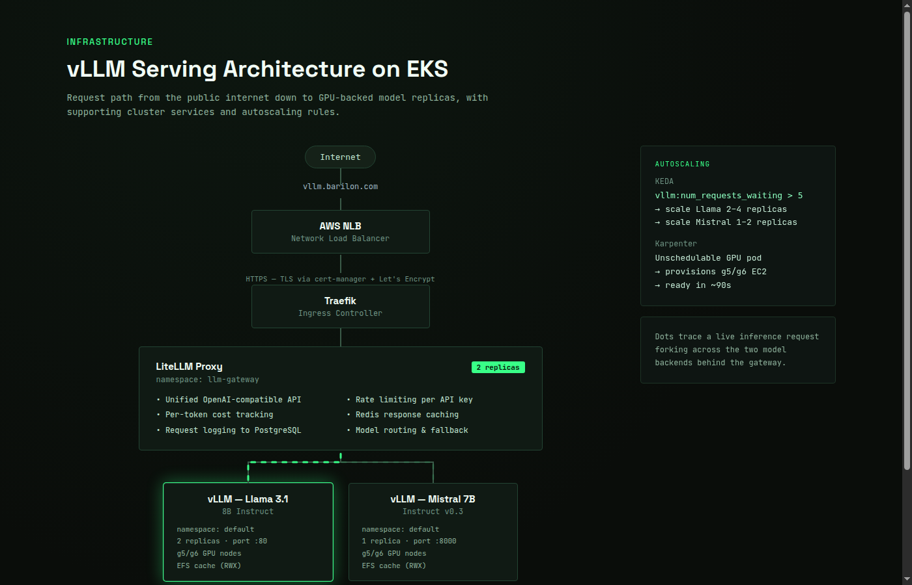

# Production LLM Inference Platform on AWS EKS

A fully Terraform-managed platform for serving open-source large language models at scale on AWS. The platform provisions an Amazon EKS cluster with GPU autoscaling, runs Meta Llama 3.1 8B and Mistral 7B through [vLLM](https://github.com/vllm-project/vllm), and routes all traffic through a [LiteLLM](https://github.com/BerriAI/litellm) proxy gateway — giving any client a single OpenAI-compatible endpoint with rate limiting, cost tracking, and response caching.

The goal: demonstrate that open-source LLM infrastructure can be production-ready — observable, cost-efficient, and operationally sound — not just a demo cluster.

---

## Architecture

[](https://isrealei.github.io/vllm-eks-inference-platform/architecture.html)

> Click the diagram to open the **interactive animated version** showing live request flow through the full stack.

**Traffic flow:**
```
Client → vllm.barilon.com → AWS NLB → Traefik → LiteLLM Proxy
                                                       ├── Redis (cache lookup)
                                                       ├── llama3    → vLLM Llama 3.1 8B  (default ns, port 80)
                                                       └── mistral-7b → vLLM Mistral 7B   (default ns, port 8000)
```

---

## What This Project Demonstrates

| Capability | Implementation |
|---|---|
| **LLM serving** | vLLM with OpenAI-compatible API, continuous batching, PagedAttention |
| **API gateway** | LiteLLM — unified routing, rate limiting, cost tracking, Redis caching |
| **Multi-model serving** | Llama 3.1 8B + Mistral 7B behind a single endpoint |
| **GPU autoscaling** | Karpenter NodePool (g5/g6 families) — provisions in ~90 seconds |
| **Request-driven scaling** | KEDA ScaledObjects keyed on `vllm:num_requests_waiting` per model |
| **Shared model cache** | Amazon EFS (ReadWriteMany) — weights downloaded once, shared across replicas |
| **Cost tracking** | LiteLLM logs every token to PostgreSQL with per-model pricing |
| **Graceful pod lifecycle** | postStart CUDA warmup + preStop drain hooks on every GPU pod |
| **TLS everywhere** | cert-manager + Let's Encrypt DNS-01 via Route53; Traefik terminates |
| **Pod Identity** | EKS Pod Identity for all CSI drivers — no IMDS or node-level IRSA |
| **Observability** | Prometheus + Grafana + DCGM GPU exporter + per-model ServiceMonitors |
| **IaC discipline** | Two-phase Terraform apply with Makefile targets; no manual kubectl steps |

---

## Design Decisions and Tradeoffs

This section walks through the non-obvious choices made in this platform and why each was made over the alternatives.

### 1. vLLM as the inference engine

**Decision:** Use vLLM rather than Hugging Face TGI, Triton, or running the model directly with `transformers`.

**Why:** vLLM implements [PagedAttention](https://arxiv.org/abs/2309.06180) — it manages the KV cache as pages instead of reserving contiguous VRAM per sequence. This allows 5–10x more concurrent requests on the same GPU compared to naive serving. It also implements continuous batching, which means requests are grouped dynamically rather than waiting for a fixed batch window. The net effect is significantly higher GPU utilisation and lower latency under concurrent load.

**Tradeoff:** vLLM is more VRAM-hungry than TGI at idle (it pre-allocates the cache). The `--gpu-memory-utilization 0.85` flag leaves 15% headroom to avoid OOM on burst traffic. TGI has a smaller memory footprint at low concurrency but degrades faster under load.

---

### 2. LiteLLM as the API gateway

**Decision:** Route all traffic through LiteLLM rather than exposing vLLM pods directly.

**Why:** Raw vLLM has no concept of API keys, rate limits, cost attribution, or multi-model routing. Adding a gateway gives the platform:

- **A single endpoint** — clients change the `model` field, never the URL
- **Authentication** — every request requires a master key or virtual key
- **Rate limiting** — per-key limits prevent one client from monopolising GPU time
- **Cost tracking** — every token logged to PostgreSQL with per-model pricing, enabling chargeback
- **Redis caching** — identical prompts return from cache without hitting the GPU (30–70% GPU saving on templated workloads)

**Tradeoff:** The gateway adds one extra network hop (~1–5ms latency overhead) and two new stateful services to maintain (Redis and PostgreSQL). For latency-critical real-time applications this is measurable. For typical LLM use cases where model inference takes 500ms–30s, the overhead is negligible.

**Why LiteLLM over Kong or a custom proxy:** LiteLLM speaks the OpenAI API natively and understands LLM-specific concepts like token counting and model routing out of the box. Kong would require custom plugins for all of this.

---

### 3. Karpenter over Cluster Autoscaler

**Decision:** Use Karpenter to provision GPU nodes rather than a managed node group with Cluster Autoscaler.

**Why:** Karpenter provisions individual EC2 instances directly — it does not round-trip through an Auto Scaling Group. This means:

- **~90 second scale-out** vs 3–5 minutes with Cluster Autoscaler (no ASG warm pool required)
- **Bin-packing** — Karpenter picks the right instance size for the pending pod, not a pre-configured fixed size
- **Consolidation** — idle GPU nodes are terminated after 10 minutes, cutting cost during off-peak hours
- **Per-GPU taint** — the `nvidia.com/gpu=NoSchedule` taint ensures only GPU-requesting pods land on expensive nodes

**Tradeoff:** Karpenter requires more upfront configuration (NodePool + NodeClass) and has more operational surface area than Cluster Autoscaler. It also requires a separate managed node group for system components — Karpenter itself cannot schedule its own controller.

---

### 4. KEDA over HPA for autoscaling

**Decision:** Use KEDA ScaledObjects driven by `vllm:num_requests_waiting` rather than the Horizontal Pod Autoscaler on CPU or memory.

**Why:** GPU inference workloads do not correlate with CPU. A vLLM pod can be fully saturating a GPU (100% compute) while its CPU usage is under 10%. Scaling on CPU would never trigger. The correct signal is the vLLM request queue depth — when more than 5 requests are waiting for a GPU slot, a new replica is needed.

```
vllm:num_requests_waiting > 5  →  scale up
GPU cache usage > 80%          →  scale up (secondary signal — VRAM pressure)
```

KEDA reads these metrics directly from Prometheus, making the scaling decision data-driven and model-specific. Llama and Mistral scale independently with their own ScaledObjects.

**Tradeoff:** KEDA requires Prometheus to be running and the vLLM ServiceMonitor to be healthy. If the metrics pipeline breaks, autoscaling stops responding. HPA is simpler to operate but blind to what actually drives load on a GPU inference server.

---

### 5. Amazon EFS over EBS for model weight caching

**Decision:** Store model weights on EFS (ReadWriteMany) rather than EBS (ReadWriteOnce) or downloading weights from Hugging Face on each pod start.

**Why:** Llama 3.1 8B weights are ~16 GB; Mistral 7B is ~14 GB. Downloading through NAT Gateway at startup would:
- Take 10–15 minutes on first start per pod
- Cost ~$0.135 per download at $0.045/GB NAT Gateway pricing
- Block readiness for every new replica during scale-out

EFS uses a separate Access Point per model. The first replica downloads and caches the weights. Every subsequent replica (including new ones added by KEDA) mounts the same EFS path and reads from cache immediately — startup time drops from 15 minutes to ~2 minutes (model load into VRAM only).

**Tradeoff:** EFS costs ~$0.30/GB/month vs $0.08/GB for EBS gp3. Two 100 GiB volumes add ~$60/month. The break-even is roughly one avoided NAT Gateway download per month. In practice the EFS cost is justified entirely by the operational simplicity of instant cold starts.

**Why not S3 with Mountpoint:** S3 Mountpoint does not support random writes, and Hugging Face's `transformers` cache writes metadata and lock files. EFS is a proper POSIX filesystem.

---

### 6. Quantization strategy — fp8 for Mistral, AWQ for Llama

**Decision:** Run Mistral 7B at fp8 precision and Llama 3.1 8B with AWQ quantization, rather than both at full bfloat16.

**Why:**

| Model | Precision | VRAM (approx) | Quality impact |
|---|---|---|---|
| Llama 3.1 8B | AWQ (4-bit) | ~6 GB | <1% benchmark degradation |
| Mistral 7B | fp8 (8-bit) | ~8 GB | Negligible at 7B scale |

Running Mistral at fp8 allows it to fit on a g6.2xlarge (24 GB VRAM) alongside its KV cache without memory pressure. Running it at bfloat16 would push it to 14+ GB and leave very little headroom for concurrent requests.

For Llama 3.1 8B, AWQ (Activation-aware Weight Quantization) compresses weights more aggressively than fp8 but applies correction factors per channel, preserving accuracy better than naive 4-bit quantization.

**Tradeoff:** Quantized models have slightly lower quality on long-context reasoning tasks. For instruction following and chat use cases (the primary workload here), the degradation is imperceptible. For scientific or mathematical reasoning at long context, full precision would be preferable.

---

### 7. Two-phase Terraform apply

**Decision:** Split deployment into a cluster phase and a workload phase rather than a single `terraform apply`.

**Why:** The Kubernetes, Helm, and kubectl Terraform providers need a live cluster endpoint to configure themselves. If the cluster doesn't exist yet, any resource that uses these providers fails immediately — even at `terraform plan`. A single apply would require Terraform to know the cluster endpoint before it has created the cluster.

The solution is two named Makefile targets:

```
make plan-cluster    →  plans VPC + EKS + Karpenter + CSI addons (AWS only)
make apply-cluster   →  provisions the cluster
make plan-workloads  →  plans all Kubernetes workloads (requires live cluster)
make apply-workloads →  deploys everything
```

**Tradeoff:** The two-phase pattern adds a manual step between infrastructure and workload deployment. The alternative — separate Terraform workspaces or Terragrunt — would give a cleaner separation but add tooling complexity. For a single-environment deployment, the Makefile approach is simpler and sufficient.

---

### 8. EKS Pod Identity over IRSA

**Decision:** Use EKS Pod Identity for CSI driver IAM rather than IAM Roles for Service Accounts (IRSA).

**Why:** Pod Identity does not require an OIDC provider to be created and managed on the AWS account. The association between a Kubernetes service account and an IAM role is a single `aws_eks_pod_identity_association` resource. Credentials are injected by the EKS agent — the pod never calls the EC2 instance metadata service (IMDS) to get credentials, which removes a lateral movement vector.

**Tradeoff:** Pod Identity requires EKS 1.24+ and the `eks-pod-identity-agent` addon. IRSA works on older clusters and is more portable across cloud providers. Given the cluster is EKS 1.35, Pod Identity is the right choice.

---

### 9. AL2023 AMI with `driver.enabled=false` in GPU Operator

**Decision:** Use Amazon Linux 2023 GPU-optimised AMI and disable driver installation in the GPU Operator.

**Why:** The AL2023 EKS-optimised GPU AMI ships with NVIDIA drivers pre-baked. If the GPU Operator also tries to install drivers, it conflicts with the existing installation and the node fails to come up. Setting `driver.enabled=false` tells the Operator to skip driver installation and only deploy the device plugin, DCGM exporter, and feature discovery.

**Tradeoff:** The driver version is tied to what AWS bakes into the AMI, not the latest NVIDIA release. For workloads requiring a specific driver version (e.g., a CUDA feature not yet in the AMI), Ubuntu with GPU Operator managing the driver gives more control.

---

### 10. Lifecycle hooks — postStart warmup and preStop drain

**Decision:** Add `postStart` and `preStop` hooks to every vLLM pod.

**postStart (warmup):**
```yaml
postStart:
  exec:
    command: ["/bin/sh", "-c", "while ! curl -s http://localhost:8000/health; do sleep 1; done && curl -s http://localhost:8000/v1/chat/completions -d '{...warmup request...}'"]
```

CUDA JIT-compiles its kernels on the first forward pass through a model. Without warmup, the first real user request absorbs this compilation cost — adding 5–15 seconds to what should be a fast response. The `postStart` hook runs a dummy inference request before the pod enters the Service endpoints, so CUDA kernels are compiled by the time real traffic arrives.

**preStop (drain):**
```yaml
preStop:
  exec:
    command: ["/bin/sh", "-c", "kill -USR1 1 2>/dev/null || true && sleep 60"]
```

When Kubernetes terminates a pod (scale-down, node drain, rolling update), it removes the pod from Service endpoints first but in-flight requests may still be in mid-generation. The `preStop` hook signals vLLM and waits 60 seconds for in-flight requests to complete before the container receives `SIGTERM`.

**Tradeoff:** The warmup adds 30–60 seconds to pod startup time (on top of the 2 minutes for model loading). For rapid scale-out scenarios, this delay is visible. The alternative — no warmup — means the first user hits a cold CUDA path.

---

### 11. Single NAT Gateway

**Decision:** Use one NAT Gateway shared across all AZs rather than one per AZ.

**Why:** A per-AZ NAT Gateway setup costs ~$175/month (5 × $32 fixed + data). A single NAT Gateway costs ~$32/month fixed plus data transfer. For a platform where the primary NAT Gateway usage is the one-time model weight download (~30 GB total), the per-AZ cost is hard to justify.

**Tradeoff:** If the NAT Gateway's AZ becomes unavailable, cross-AZ egress traffic from other AZs fails. For this platform, the main impact would be that new GPU nodes in other AZs cannot reach Hugging Face to download model weights. Since weights are cached on EFS, this only affects the very first cold start in a new AZ. For a production deployment with SLA requirements, adding per-AZ NAT Gateways removes this single point of failure.

---

## Technology Stack

| Layer | Technology | Version |
|---|---|---|
| Infrastructure | Terraform | ~1.15 |
| Cloud | AWS (EKS, EFS, EBS, IAM, VPC, Route53, NLB) | Provider 6.42 |
| Kubernetes | Amazon EKS | 1.35 |
| GPU Autoscaling | Karpenter | 1.6.0 |
| LLM Gateway | LiteLLM Proxy | latest |
| LLM Serving | vLLM | 0.6.3 |
| Models | Llama 3.1 8B Instruct · Mistral 7B Instruct v0.3 | — |
| GPU Runtime | NVIDIA GPU Operator | v26.3.1 |
| Event-driven Scaling | KEDA | 2.16.1 |
| Ingress | Traefik | 34.5.0 |
| TLS | cert-manager + Let's Encrypt (DNS-01 / Route53) | v1.18.2 |
| Metrics | kube-prometheus-stack | 70.4.2 |
| Gateway Database | PostgreSQL 16 | StatefulSet |
| Gateway Cache | Redis 7 | Deployment |
| Model Storage | Amazon EFS (encrypted, ReadWriteMany) | — |
| Block Storage | Amazon EBS gp3 (encrypted) | — |

---

## Project Structure

```
barilon/
├── README.md
├── scripts/
│   └── load-test.py                  # vLLM load testing script
│
├── module/                           # Reusable Terraform modules
│   ├── networking/                   # VPC, subnets, NAT gateway, route tables
│   └── eks/                          # EKS cluster, node groups, IAM, addons
│
└── infra-live/                       # Production root module
    ├── Makefile                      # Phased deployment commands
    ├── providers.tf                  # AWS, Kubernetes, Helm, kubectl providers
    ├── variables.tf                  # All input variable declarations
    ├── outputs.tf
    │
    ├── main.tf                       # VPC + EKS + Karpenter module calls
    ├── karpenter.tf                  # Karpenter Helm + NodePool/NodeClass manifests
    ├── gpu-operator.tf               # NVIDIA GPU Operator (driver.enabled=false, AL2023)
    ├── ebs.tf                        # EBS CSI driver, Pod Identity, gp3 StorageClass
    ├── efs.tf                        # EFS filesystem, mount targets, CSI driver, StorageClass
    ├── vllm.tf                       # Llama 3.1 8B — Service, PVC, PDB, HF Secret
    ├── mistral.tf                    # Mistral 7B — Service, PVC, ServiceMonitor, ScaledObject
    ├── litellm.tf                    # LiteLLM gateway — Proxy, Redis, PostgreSQL, Ingress
    ├── monitoring.tf                 # Prometheus stack, Grafana, vLLM ServiceMonitor
    ├── keda.tf                       # KEDA Helm + Llama ScaledObject
    ├── cert-manager.tf               # cert-manager, ClusterIssuers, Route53 IAM
    ├── ingress.tf                    # AWS Load Balancer Controller + Traefik
    │
    ├── karpenter/
    │   ├── values.yaml.tpl
    │   ├── nodepool-default.yaml     # General-purpose NodePool (c/m/r families)
    │   ├── nodepool-gpu.yaml         # GPU NodePool (g5/g6, on-demand, tainted)
    │   ├── nodeclass-default.yaml.tpl
    │   └── nodeclass-gpu.yaml.tpl   # AL2023 AMI, 100 GiB gp3 root disk
    │
    └── vllm/
        ├── deployment.yaml           # Llama 3.1 8B Deployment manifest
        └── mistral-deployment.yaml   # Mistral 7B Deployment manifest
```

---

## How It Works

### Cluster Foundation

A 2-node managed node group (`t3.medium`) runs all system components — Karpenter, KEDA, GPU Operator, Prometheus, Grafana, Traefik, cert-manager, and the full LiteLLM stack. These nodes are provisioned in Phase 1 and never serve inference traffic.

### GPU Node Provisioning

The `gpu-inference` NodePool targets `g5` and `g6` instance families with a `nvidia.com/gpu=NoSchedule` taint. When a vLLM pod is pending (no GPU available), Karpenter provisions a new EC2 instance in ~90 seconds. Idle GPU nodes are consolidated after 10 minutes to avoid paying for unused capacity.

```yaml
requirements:
  - key: karpenter.k8s.aws/instance-family
    operator: In
    values: ["g5", "g6"]    # A10G (g5) and L4 (g6) GPUs
taints:
  - key: nvidia.com/gpu
    effect: NoSchedule       # Only GPU-requesting pods land here
```

### Inference Backends

**Llama 3.1 8B** — 1 replica minimum, 4 maximum, 1 GPU each, AWQ quantization, served as `llama3`.

**Mistral 7B Instruct v0.3** — 1 replica minimum, 4 maximum, 1 GPU each, fp8 quantization, served as `mistral-7b`.

Both deployments include lifecycle hooks:
- **postStart** — waits for the health endpoint then fires a warmup inference request to pre-compile CUDA kernels before any user traffic arrives
- **preStop** — signals vLLM and waits 60 seconds for in-flight requests to drain before the container is killed

### Request-Driven Autoscaling

Each model has its own KEDA `ScaledObject` watching two Prometheus metrics:

| Model | Queue trigger | Cache trigger | Min | Max |
|---|---|---|---|---|
| Llama 3.1 8B | `num_requests_waiting > 5` | `gpu_cache_usage > 80%` | 2 | 4 |
| Mistral 7B | `num_requests_waiting > 5` | `gpu_cache_usage > 80%` | 1 | 2 |

When KEDA adds a replica, Karpenter sees the pending GPU pod and provisions a new node. The replica is ready (including CUDA warmup) before the next polling interval.

### LiteLLM Gateway

LiteLLM sits in the `llm-gateway` namespace and proxies all requests. Its config maps model names to internal service URLs:

```yaml
model_list:
  - model_name: llama3
    litellm_params:
      api_base: http://vllm-llama3.default.svc.cluster.local:80/v1
  - model_name: mistral-7b
    litellm_params:
      api_base: http://mistral-7b.default.svc.cluster.local:8000/v1
```

Redis caches responses for 1 hour. PostgreSQL stores a log of every request with token counts and cost. The proxy runs 2 replicas with a `PodDisruptionBudget` ensuring at least 1 is always available during node maintenance.

### TLS and Ingress

Traefik runs as the ingress controller backed by an internet-facing NLB provisioned by the AWS Load Balancer Controller. cert-manager issues Let's Encrypt certificates via Route53 DNS-01 — no port 80 exposure required.

```
vllm.barilon.com    → NLB → Traefik → LiteLLM (llm-gateway ns)
grafana.barilon.com → NLB → Traefik → Grafana  (monitoring ns)
```

---

## Deployment

### Prerequisites

- AWS CLI configured with a named profile
- Terraform ≥ 1.15
- `kubectl` and `helm` installed locally
- Hugging Face account with access to [Llama 3.1 8B](https://huggingface.co/meta-llama/Meta-Llama-3.1-8B-Instruct) and [Mistral 7B](https://huggingface.co/mistralai/Mistral-7B-Instruct-v0.3)
- Route53 hosted zone for your domain
- S3 bucket for Terraform remote state

### Configuration

Copy the example tfvars and fill in values:

```bash
cp infra-live/terraform.tfvars.example infra-live/terraform.tfvars
```

Key variables:

| Variable | Description |
|---|---|
| `cluster_name` | EKS cluster name |
| `eks_version` | Kubernetes version (e.g. `"1.35"`) |
| `dns_zone_name` | Route53 hosted zone (e.g. `barilon.com`) |
| `acme_email` | Email for Let's Encrypt registration |
| `hf_token` | Hugging Face API token (sensitive) |
| `grafana_password` | Grafana admin password (sensitive) |
| `litellm_master_key` | LiteLLM master API key (sensitive) |
| `litellm_pg_password` | PostgreSQL password for LiteLLM (sensitive) |
| `admin_user_arn` | IAM user/role ARN with cluster-admin access |
| `api_allowed_cidrs` | CIDRs allowed to reach the EKS API endpoint |

`terraform.tfvars` is gitignored — never commit it.

### Phase 1 — Cluster Foundation

```bash
cd infra-live
make plan-cluster    # Review what will be created
make apply-cluster   # Provision VPC, EKS, Karpenter, CSI drivers
```

After Phase 1, configure kubeconfig and restart CSI controllers to pick up Pod Identity credentials:

```bash
aws eks update-kubeconfig --name <cluster_name> --region us-east-1 --profile <profile>
kubectl rollout restart deployment/efs-csi-controller -n kube-system
kubectl rollout restart deployment/ebs-csi-controller -n kube-system
```

### Phase 2 — Workloads

```bash
make plan-workloads  # Review Kubernetes resources
make apply-workloads # Deploy everything
```

Monitor model weight downloads (one-time; ~16 GB Llama, ~14 GB Mistral):

```bash
kubectl logs -f deployment/vllm-llama3
kubectl logs -f deployment/mistral-7b
```

### Calling the API

Once deployed, both models are reachable through a single endpoint:

```bash
# Llama 3.1 8B
curl https://vllm.barilon.com/v1/chat/completions \
  -H "Authorization: Bearer $LITELLM_MASTER_KEY" \
  -H "Content-Type: application/json" \
  -d '{"model": "llama3", "messages": [{"role": "user", "content": "Explain Karpenter in one paragraph."}]}'

# Mistral 7B — same endpoint, change model name only
curl https://vllm.barilon.com/v1/chat/completions \
  -H "Authorization: Bearer $LITELLM_MASTER_KEY" \
  -H "Content-Type: application/json" \
  -d '{"model": "mistral-7b", "messages": [{"role": "user", "content": "Explain Karpenter in one paragraph."}]}'
```

### Updating a Deployment

Since KEDA manages replicas, the Deployment `yaml_body` is set to `ignore_changes` in Terraform. To push a YAML update (new image, changed args):

```bash
terraform apply -replace=kubectl_manifest.vllm               # Llama
terraform apply -replace=kubectl_manifest.mistral_deployment  # Mistral
```

### Teardown

Scale down GPU workloads first so Karpenter can deprovision GPU nodes before the VPC is destroyed:

```bash
kubectl scale deployment vllm-llama3 mistral-7b --replicas=0 -n default
kubectl delete nodeclaim --all
helm uninstall traefik -n traefik    # removes the NLB
cd infra-live && make destroy
```

### Day-2 Operations

```bash
make plan-cluster    # Plan AWS-only resources (safe before cluster exists)
make plan-workloads  # Plan all workloads (requires live cluster)
make plan            # Fast plan — skips refresh, for iteration
make apply           # Apply a saved plan file
make destroy         # Tear down everything
make fmt             # Format all Terraform files
make validate        # Validate configuration
```

---

## Observability

### vLLM Metrics (per model, via ServiceMonitor)

| Metric | What it tells you |
|---|---|
| `vllm:num_requests_waiting` | Queue depth — primary KEDA scale trigger |
| `vllm:gpu_cache_usage_perc` | KV cache pressure — secondary scale trigger at >80% |
| `vllm:num_requests_running` | Active GPU inference slots |
| `vllm:e2e_request_latency_seconds` | End-to-end latency histogram |
| `vllm:tokens_per_second` | Inference throughput |

### GPU Metrics (DCGM Exporter via GPU Operator)

| Metric | What it tells you |
|---|---|
| `DCGM_FI_DEV_GPU_UTIL` | Compute utilisation % |
| `DCGM_FI_DEV_FB_USED` | VRAM used (bytes) |
| `DCGM_FI_DEV_GPU_TEMP` | Temperature — useful for detecting thermal throttling |

Grafana is available at `grafana.barilon.com`. The LiteLLM built-in dashboard at `/ui` shows per-key spend and request volume.

---

## Networking Design

| Subnet type | CIDRs | Purpose |
|---|---|---|
| Public | 10.0.1–2–3–7–8.0/24 | NLB, NAT Gateway |
| Private | 10.0.4–5–6–9–10.0/24 | EKS nodes (all workloads) |

- 5 AZs (us-east-1a/b/c/d/f) — us-east-1e excluded (limited GPU capacity)
- Single NAT Gateway — cost-optimised; add per-AZ for full egress HA
- EFS mount targets in every private subnet for AZ-local NFS throughput
- EFS security group allows TCP 2049 from VPC CIDR only

---

## Security

- **EKS Pod Identity** for EBS CSI, EFS CSI, cert-manager, and AWS Load Balancer Controller — no node-level IRSA, no IMDS access from pods
- **Least privilege IAM** — each component carries only the minimum policy required
- **EFS encrypted at rest**; EBS gp3 volumes with `encrypted=true`
- **EKS API auth mode** — access entries scoped to the admin IAM user only; no `aws-auth` ConfigMap
- **AL2023 GPU AMI** — NVIDIA drivers pre-baked; GPU Operator does not reinstall them
- **LiteLLM master key** — authentication required on every API request; vLLM pods are not exposed directly

---

## Known Limitations

| Limitation | Notes |
|---|---|
| **Single NAT Gateway** | Cross-AZ egress fails if NAT GW's AZ goes down. Add per-AZ NAT Gateways for production SLA. |
| **Secrets in tfvars** | `hf_token`, `litellm_master_key`, `litellm_pg_password` should move to AWS Secrets Manager for team use. |
| **No NetworkPolicy** | Pods communicate freely within the cluster. Add Calico or VPC CNI policies to isolate namespaces. |
| **Single GPU per vLLM pod** | Each pod requests 1 GPU. For 70B+ models, switch to `ray` distributed executor and request multiple GPUs. |
| **PostgreSQL single replica** | The LiteLLM database has no HA. Replace with Amazon RDS for production durability. |
| **Plaintext provider config** | Helm provider uses exec-based token — secure in CI with short-lived credentials, but review for long-lived environments. |

---

## Cost Profile

| Resource | Type | Estimated monthly |
|---|---|---|
| EKS control plane | Managed | ~$73 |
| System nodes (2× t3.medium) | On-demand | ~$60 |
| Llama GPU nodes (2× g5.2xlarge) | On-demand | ~$1,100 |
| Mistral GPU node (1× g6.2xlarge) | On-demand | ~$400 |
| EFS (2× 100 GiB volumes) | Standard | ~$60 |
| EBS — Prometheus (50 GiB gp3) | gp3 | ~$5 |
| EBS — PostgreSQL (10 GiB gp3) | gp3 | ~$1 |
| NAT Gateway | Fixed + data | ~$35 |
| Route53 + cert | Hosted zone | ~$1 |
| **Total (full running)** | | **~$1,735/month** |

Karpenter consolidates idle GPU nodes after 10 minutes. Off-peak cost is just the system node group (~$133/month). Model weights are cached on EFS — the one-time NAT Gateway download cost (~$1.35 per model) is never repeated on restart or scale-out.
